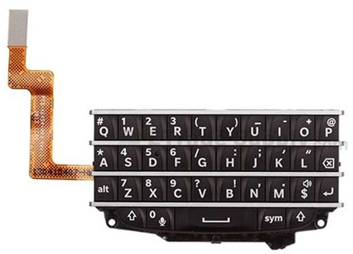
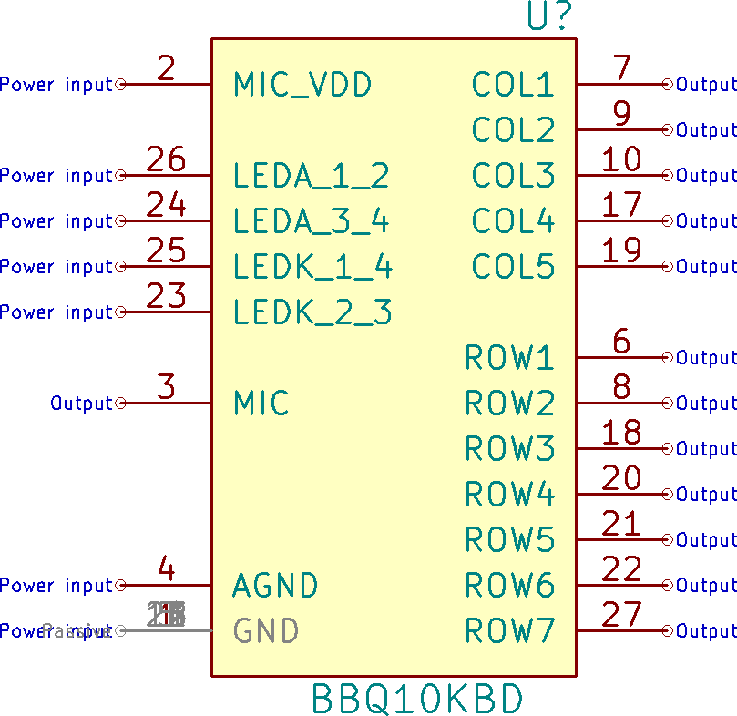
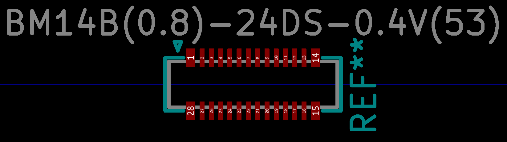
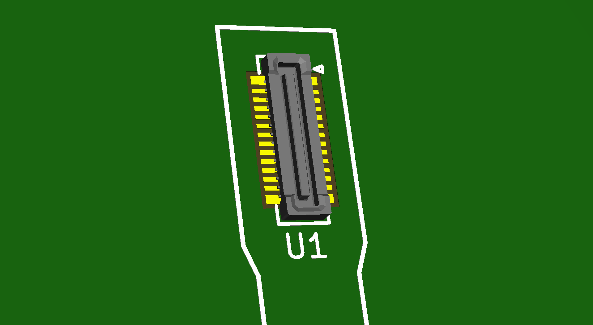
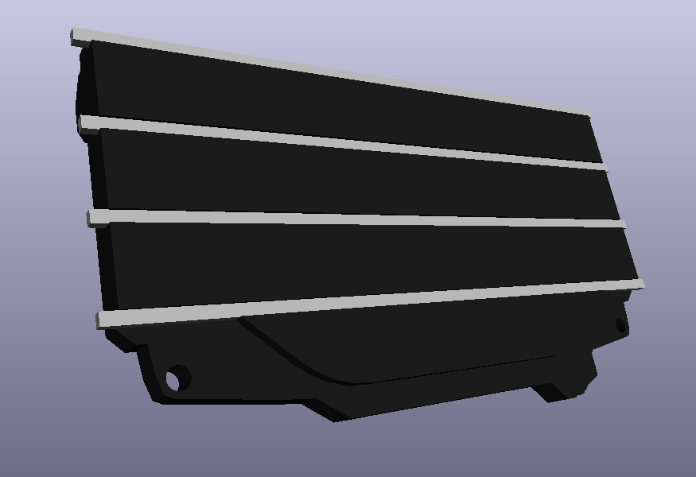
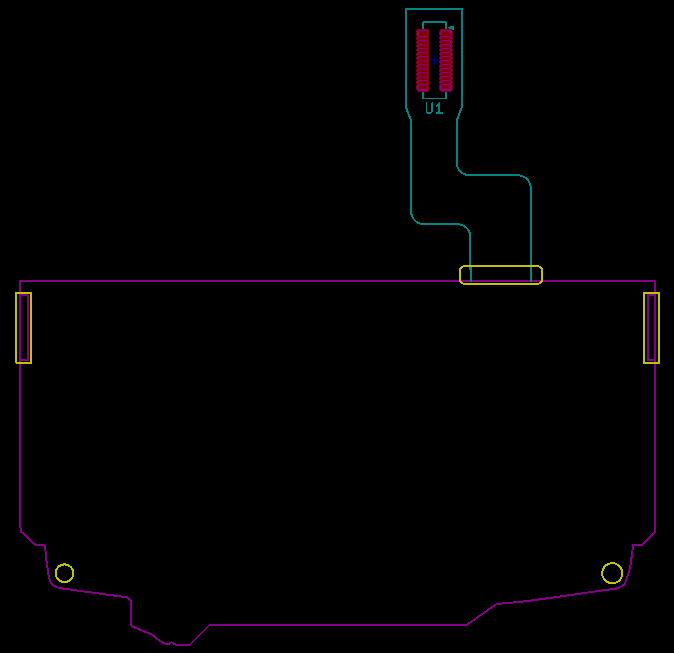

# Blackberry Q10 Keyboard

This document tries to summarize all the findings about the Blackberry Q10 keyboard, which seems interesting for DIY projects.
The keyboard has a nice feel to it, is just the right size for typing and is fairly cheap (around 3 USD on Aliexpress).  
It's available in black and white, there are versions with other letters like Arabic and Russian in addition to Latin. See [6] for details.  
It also has a 4 LED backlight and a built-in MEMS microphone which can come in handy.



### Reversing on the pinout

Most of the work was done by others in [2] and [1], but after discovering the microphone, I was curious to see how it was connected and get the complete pinout of the keyboard. The flex PCB inside the keyboard is covered with a black film, but it is possible to remove the film by lifting a edge with a scalpel and slowly peeling it off, it might break mid-way but you can just lift the corner and continue.

A high resolution scan of the flex is available in this respository in `flex_scan.png`

Pinout:
```

    GND   1 | 28  GND
MIC_VDD   2 | 27  ROW7
    MIC   3 | 26  LEDA 1 & 2
   AGND   4 | 25  LEDK 1 & 4
    GND   5 | 24  LEDA 3 & 4
   ROW1   6 | 23  LEDK 2 & 3
   COL1   7 | 22  ROW6
   ROW2   8 | 21  ROW5
   COL2   9 | 20  ROW4
   COL3  10 | 19  COL5
    GND  11 | 18  ROW3
    GND  12 | 17  COL4
    GND  13 | 16  GND
    GND  14 | 15  GND
```

Since the numbering can be confusing (is it the plug or the receptacle?), see footprint below for clarification.

### KiCad resources

NOTE: These are not yet tested and while they are based on other people's working prototypes, I can't give a 100% guarantee these are correct, once I receive my board and verify everything, I will modify the document to reflect my findings.

Here is the final schematic symbol with the complete pinout, only one GND is visible, the rest is stacked under it and set to be invisible.



The receptacle for the keyboard connector is the Hirose BM14B(0.8)-24DS-0.4V(53), the datasheet is freely available and Hirose even offers a 3d model of the connector, if you like it.





There's also a 3d model of the keyboard itself which I took from [4] and converted to wrl.



I have a outline of the keyboard with the holes for tabs, but I haven't created a proper footprint file for it yet, will add in the near future:



### Column/Row to key matrix

Copied from [3]

Regular keys:

|          | COL1 | COL2 | COL3 | COL4 | COL5 | 
|----------|------|------|------|------|------| 
| **ROW1** | Q    | E    | R    | U    | O    |
| **ROW2** | W    | S    | G    | H    | L    |
| **ROW3** | sym  | D    | T    | Y    | I    |
| **ROW4** | A    | P    | R ⇧  | ↵    | ⌫   |
| **ROW5** | alt  | X    | V    | B    | $    |
| **ROW6** | spac | Z    | C    | N    | M    |
| **ROW7** | 🎤   | L ⇧  | F    | J    | K    |

Alternative keys:

|          | COL1 | COL2 | COL3 | COL4 | COL5 |
|----------|------|------|------|------|------|
| **ROW1** |   #  |   2  |   3  |   _  |   +  |
| **ROW2** |   1  |   4  |   /  |   :  |   "  |
| **ROW3** |      |   5  |   (  |   )  |   -  |
| **ROW4** |   *  |   @  |      |      |      |
| **ROW5** |      |   8  |   ?  |   !  |  🔊  |
| **ROW6** |      |   7  |   9  |   ,  |   .  |
| **ROW7** |   0  |      |   6  |   ;  |   '  |

### Blackberry UX

This part describes the way the Blackberry phone used the keyboard, might be a good reference and starting point for implementing a custom UX. Based on [7].

- Pressing the space twice adds a period and capitalizes the next letter
- Pressing and holding a letter key inserts capitalizes the letter
- Alt + R ⇧ turns on Caps Lock, pressing either shift turns it off
- Alt + L ⇧ turns on Num Lock, pressing either shift turns it off
- Pressing Alt will make the next key pressed insert a symbol from the alternative keys matrix
- Pressing Shift will make the next key pressed be capitalized

### Acknowledgements / Thanks

Huge thanks to JoeN for doing the initial reversing of the keyboard and finding the proper connector, and to WooDWorkeR for finding the backlight pinout and indirectly getting me interested in this keyboard in the first place.  
Also thanks to ccadic for providing the 3d model of the keyboard.

### Sources

[1] https://hackaday.io/project/27520-pimp-personal-information-manager-pager  
[2] https://www.eevblog.com/forum/beginners/how-to-connect-to-a-very-very-challanging-blackberry-q10-keyboard-connector/  
[3] https://forum.arduino.cc/index.php?topic=355709.0  
[4] https://grabcad.com/library/blackberry-q10-keyboard-shape-1  
[5] https://www.hirose.com/product/en/products/BM14/BM14B%280.8%29-24DS-0.4V%2853%29/  
[6] https://help.blackberry.com/en/blackberry-q10/10.3.1/help/mar1396885531697.html  
[7] https://help.blackberry.com/en/blackberry-q10/10.3.1/help/mba1343750483597.html   
